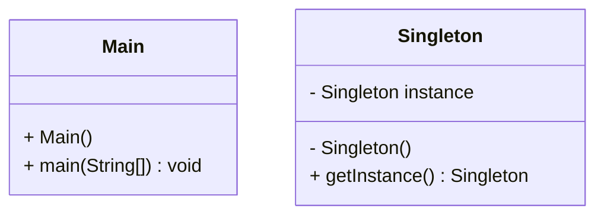

# E25-A13-Design_Pattern

## INTRO
- programmation procedurale 
- fonctions procédures
- orienté objet (1-Encapsulation, 2-Abstraction(), 3-Héritage, 4-Polymorphisme) 
- GOF (23 design pattern )
- Librairies (ensemble de packages ... on y trouve les design pattern)
- Framework (librairie + partie du code réutilisable + partie du code spécifique au projet + Design pattern, Force à utiliser les bonnes pratiques, ex force la séparation MVC )
- Utiliser l'expérience des autres. Ne pas réinventer la roue.

## SINGLETON 

 
